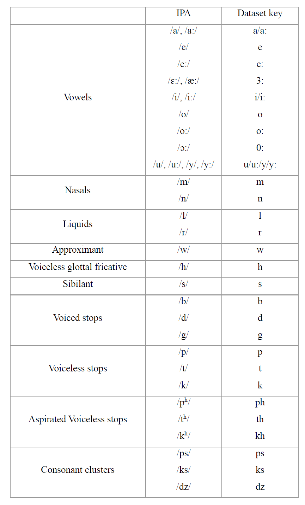
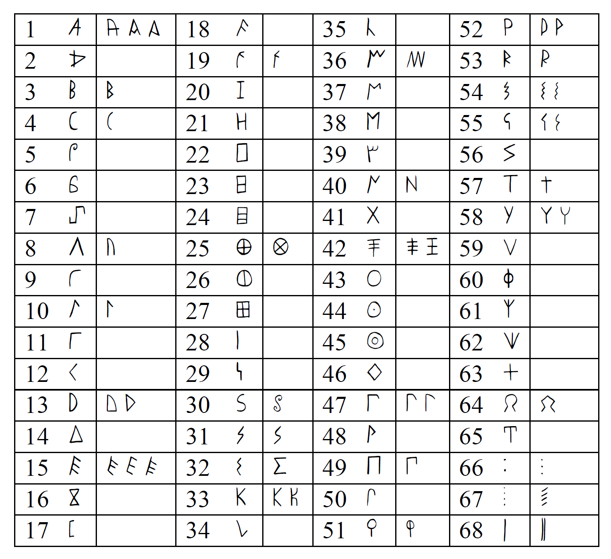

# Measuring particularity and similarity in archaic Greek alphabets with NLP 

This code supports the paper: Elvira Astoreca, N. (Forthcoming) "Measuring particularity and similarity in archaic Greek alphabets with NLP" in Steele, P.M. & Boyes, P.J. (eds.) *Writing Around the Ancient Mediterranean: Practices and Adaptations*. It consists of a series of experiments that apply TF-IDF to Greek epigraphical evidence of the 8th and 7th centuries BC to measure:
1. the most characteristic graphematic features of each regional alphabet 
2. which alphabets are more similar to each other

All tables and results of the experiments are saved in the folder output/

## Replicating the experiments

- Clone this repository
- Install required libraries `pip install -r requirements.txt`
- Open experiments.ipynb and run all cells

## Representation of phonemes and signs
Table 1: Phonemes considered and their representation in the dataset

Table 2: Signs and their allographs with the numeric codes used in the dataset

